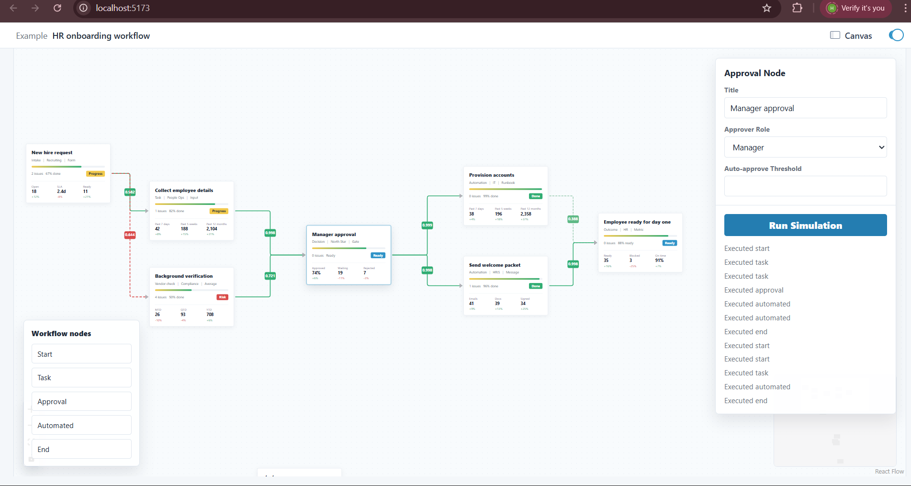

# HR Workflow Designer (React Flow)

##  Overview
A visual workflow builder for HR processes (onboarding, approvals, automation).

## Screenshot
### Workflow Canvas


# Architecture
- React + TypeScript
- Redux Toolkit (global state)
- React Flow (graph engine)
- TailwindCSS (UI)
- Modular folder structure

##  Features
- Drag & drop nodes
- Connect workflows
- Dynamic node configuration forms
- Mock API integration
- Workflow simulation panel

## 🧾 Submission Notes

### 🔧 Tricky Bug Solved
One challenging bug I faced was React Flow node state desynchronization with global state.

**Issue:**  
Updating node data via local state didn’t reflect in Redux.

**Fix:**  
I centralized updates via Redux actions and ensured React Flow state sync using controlled nodes and edges.

**Result:**  
Improved consistency and eliminated UI mismatch issues.

##  How to Run

```bash
npm install
npm run dev